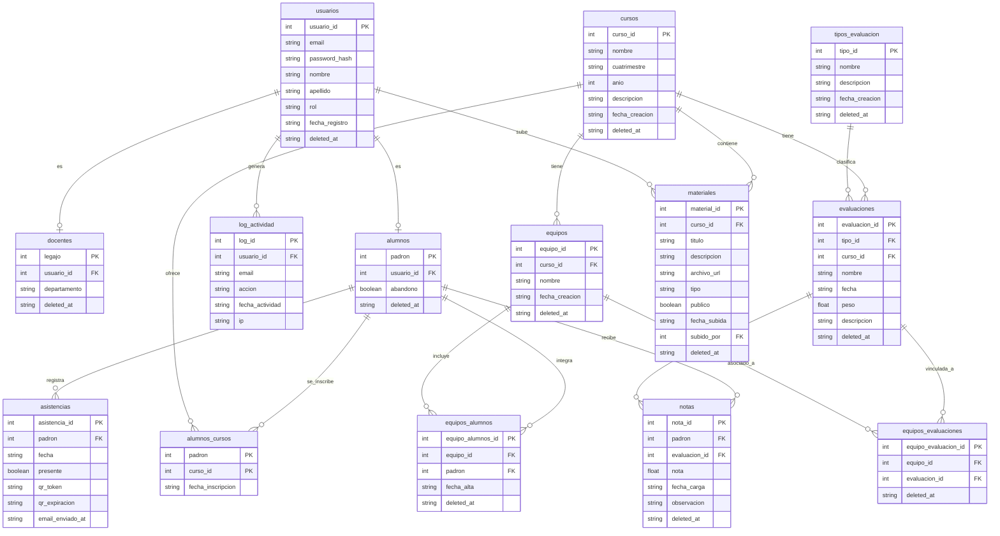

# Gestor Universitario FIUBA — Backend

API REST desarrollada con Flask y MySQL para la gestión de cursos universitarios.
Proyecto final de Introducción al Desarrollo de Software — Curso Lanzillota 2026.

> **💡 Frontend:** El repositorio correspondiente al backend de esta aplicación se encuentra disponible en: `https://github.com/gjoel6055-wq/gestor-universitario-armjsss`
---

## Tecnologías

- **Python 3.12**
- **Flask** — framework web
- **MySQL** — base de datos relacional
- **mysql-connector-python** — conexión a MySQL
- **PyJWT** — autenticación con tokens JWT
- **Werkzeug** — hash de contraseñas
- **python-dotenv** — variables de entorno

---

## Estructura del proyecto

```
gestion_curso_fiuba/
├── Backend/
│   ├── app/
│   │   ├── db.py                               # Conexión a MySQL
│   │   ├── constants.py                        # Constantes globales (regex, etc)
│   │   ├── routes/
│   │   │   ├── auth.py                         # POST /login, /registro, /logout
│   │   │   ├── usuarios.py                     # GET /usuarios
│   │   │   ├── alumnos.py                      # CRUD alumnos + abandono + CSV
│   │   │   ├── docentes.py                     # CRUD docentes
│   │   │   ├── cursos.py                       # CRUD cursos
│   │   │   ├── tipos_evaluacion.py             # CRUD tipos de evaluación
│   │   │   ├── evaluaciones.py                 # CRUD evaluaciones
│   │   │   ├── equipos.py                      # CRUD equipos + alumnos + evaluaciones
│   │   │   ├── notas.py                        # CRUD notas
│   │   │   ├── asistencias.py                  # QR + asistencias
│   │   │   └── log.py                          # Consulta de log de actividad
│   │   ├── services/
│   │   │   ├── auth_service.py                 # Login, registro, decorador JWT
│   │   │   ├── alumno_service.py
│   │   │   ├── docente_service.py
│   │   │   ├── curso_service.py
│   │   │   ├── tipo_evaluacion_service.py
│   │   │   ├── evaluacion_service.py
│   │   │   ├── equipo_service.py
│   │   │   ├── nota_service.py
│   │   │   ├── asistencia_service.py
│   │   │   ├── log_service.py
│   │   │   ├── qr_service.py
│   │   │   └── mail_service.py
│   │   └── repositories/
│   │       ├── usuario_repository.py
│   │       ├── alumno_repository.py
│   │       ├── docente_repository.py
│   │       ├── curso_repository.py
│   │       ├── tipo_evaluacion_repository.py
│   │       ├── evaluacion_repository.py
│   │       ├── equipo_repository.py
│   │       ├── nota_repository.py
│   │       ├── asistencia_repository.py
│   │       └── log_repository.py
│   ├── database/
│   │   ├── schema.sql                          # Creación de tablas
│   │   └── seed.sql                            # Datos de prueba
│   └── app.py                                  # Punto de entrada
├── README.md
├── requirements.txt
├── setup_virtualenv.sh
├── setup_virtualenv.bat
├── .env
└── .env.example
```

---

## Instalación y configuración

### 1. Clonar el repositorio

```bash
git clone https://github.com/gjoel6055-wq/gestor-universitario-armjsss
cd gestor-universitario-armjsss
```

### 2. Configurar la Base de Datos con MySQL local

Si ya tenes MySQL corriendo en tu maquina (puerto 3306 por defecto):

Crear la base de datos y cargar el esquema y datos de prueba:

**Linux / macOS / WSL:**
```bash
mysql -u root -p -e "CREATE DATABASE IF NOT EXISTS gestor_universitario;"
mysql -u root -p gestor_universitario < Backend/database/schema.sql
mysql -u root -p gestor_universitario < Backend/database/seed.sql
```

**Windows PowerShell:**
```powershell
mysql -u root -p -e "CREATE DATABASE IF NOT EXISTS gestor_universitario;"
Get-Content Backend\database\schema.sql | mysql -u root -p gestor_universitario
Get-Content Backend\database\seed.sql | mysql -u root -p gestor_universitario
```

Verificar que las tablas se hayan creado:
```bash
mysql -u root -p -e "USE gestor_universitario; SHOW TABLES;"
```
*Si tu usuario, password, puerto o nombre de base no coinciden con los defaults, actualiza el `.env` antes de levantar la API.*

### 3. Configurar las variables de entorno

```bash
cp .env.example .env
```

Editá el archivo `.env` con tus credenciales:

```env
EMAIL_SENDER=gestoruniversitario123@gmail.com
EMAIL_PASSWORD=tu contraseña de negocio
API_BASE_URL = "http://127.0.0.1:8080"
FRONT_BASE_URL = "http://127.0.0.1:5030"
DB_HOST = "127.0.0.1"
DB_PORT="3306"
DB_USER="root"
DB_PASSWORD=""
DB_NAME="gestor_universitario"
SECRET_KEY=tu_clave_secreta_larga_y_segura
```

### 4. Entorno virtual, instalación y ejecución

El proyecto incluye scripts de setup que crean el entorno virtual, instalan las dependencias y levantan la API automáticamente.

**Windows:**
```cmd
setup_virtualenv.bat
```

**Linux / macOS:**
```bash
chmod +x setup_virtualenv.sh
./setup_virtualenv.sh
```

Una vez iniciada, la API estará disponible en `http://localhost:8080`.

---

## Autenticación

La API usa **JWT (JSON Web Tokens)**. El token se obtiene en el login y debe enviarse en el header de cada request:

```
Authorization: Bearer <token>
```

El token expira a las **8 horas**. Hay dos roles:

| Rol | Permisos |
|---|---|
| `docente` | Acceso completo a todos los endpoints |
| `alumno` | Solo puede ver sus propias notas y asistencias |

---

## Endpoints

### Autenticación

| Método | Endpoint | Descripción | Auth |
|---|---|---|---|
| POST | `/login` | Iniciar sesión | No |
| POST | `/registro` | Registrar cuenta | No |
| POST | `/logout` | Cerrar sesión | Sí |

**POST /login**
```json
{
  "email": "garcia.carlos@fiuba.edu.ar",
  "password": "password123"
}
```

**Respuesta exitosa:**
```json
{
  "mensaje": "Login exitoso",
  "token": "eyJ...",
  "datos": {
    "nombre": "Carlos",
    "email": "garcia.carlos@fiuba.edu.ar",
    "rol": "docente"
  }
}
```
**Errores:** 404 `{"error": "El email ingresado no se encuentra registrado."}`, 401 `{"error": "La contraseña ingresada es incorrecta"}`

#### POST `/registro`
**Request:**
```json
{
  "nombre": "Juan",
  "apellido": "Perez",
  "email": "juanperez@fiuba.edu.ar",
  "password": "password123",
  "padron": "105554"
}
```
**Éxito (201 Created):** `{"mensaje": "Se creó el usuario con exito."}`
**Errores:** 400 `{"error": "Todos los campos son obligatorios"}`, 409 `{"error": "El email ingresado ya se encuentra en uso."}`

#### POST `/logout`
**Éxito (200 OK):** `{"mensaje": "Se cerró la sesión con exito."}`

---

### Cursos

| Método | Endpoint | Descripción | Rol |
|---|---|---|---|
| GET | `/cursos` | Listar todos los cursos | Cualquiera |
| GET | `/cursos/<curso_id>` | Ver curso por ID | Cualquiera |
| POST | `/cursos` | Crear curso | Docente |
| PUT | `/cursos/<curso_id>` | Actualizar curso completo (todos los campos requeridos) | Docente |
| PATCH | `/cursos/<curso_id>` | Actualizar campos parciales (solo los campos enviados) | Docente |
| DELETE | `/cursos/<curso_id>` | Eliminar curso (lógico) | Docente |

**POST /cursos**
```json
{
  "nombre": "Introducción al Desarrollo de Software",
  "cuatrimestre": "1C",
  "anio": 2026,
  "descripcion": "Curso introductorio con Python y Flask"
}
```
**Éxito (201):** Objeto del curso creado.
**Errores:** 400 `{"error": "El cuerpo de la solicitud no puede estar vacío"}`, 409 `{"error": "el curso ya existe"}`

#### PUT `/cursos/<int:curso_id>`
Reemplaza todos los campos del curso. Todos los campos son obligatorios.
```json
{
  "nombre": "Intro al Desarrollo (Actualizado)",
  "cuatrimestre": "2C",
  "anio": 2026,
  "descripcion": "Nuevo temario"
}
```
**Errores:** 400 (Cuerpo vacío o campo faltante), 404 (No encontrado), 409 (Nombre duplicado).

#### PATCH `/cursos/<int:curso_id>`
Actualiza solo los campos enviados. Los campos omitidos conservan su valor actual.
```json
{
  "descripcion": "Solo actualizo descripcion"
}
```
**Errores:** 400 (Cuerpo vacío), 404 (No encontrado), 409 (Nombre duplicado).

#### DELETE `/cursos/<int:curso_id>`
**Éxito (200):** `{"mensaje": "Curso {id} eliminado correctamente"}`
**Errores:** 400 (Error validación), 404 `{"error": "curso no encontrado"}`, 409 `{"error": "el curso tiene dependencias asociadas"}`

---

### Alumnos

| Método | Endpoint | Descripción | Rol |
|---|---|---|---|
| GET | `/alumnos` | Listar alumnos | Docente |
| GET | `/alumnos?estado=activo` | Filtrar por estado | Docente |
| GET | `/alumnos?curso_id=<id>` | Filtrar por curso | Docente |
| GET | `/alumnos/<padron>` | Ver alumno por padrón | Docente |
| POST | `/alumnos` | Crear alumno | Docente |
| PUT | `/alumnos/<padron>` | Actualizar alumno completo | Docente |
| PATCH | `/alumnos/<padron>` | Actualizar campos parciales | Docente |
| PATCH | `/alumnos/<padron>/abandono` | Marcar como abandonó | Docente |
| DELETE | `/alumnos/<padron>` | Eliminar alumno (lógico) | Docente |
| POST | `/alumnos/importar-csv` | Importar masivamente | Docente |

#### GET `/alumnos` y GET `/alumnos/<int:padron>`
**Éxito (200):** Devuelve alumnos. **Errores:** 404 `{"error": "Alumno no encontrado."}`

#### POST `/alumnos`
**Request:**
```json
{
  "padron": "103963",
  "nombre": "Carolina",
  "apellido": "Di Matteo",
  "email": "cdimatteo@fiuba.edu.ar",
  "password": "password123"
}
```
**Éxito (201):** Alumno creado.
**Errores:** 400 `{"error": "Faltan campos obligatorios"}`, 409 `{"error": "El padrón ya está registrado."}` o `"El email ya está registrado."`

#### PUT `/alumnos/<int:padron>` y PATCH `/alumnos/<int:padron>`
**Request PUT/PATCH:**
```json
{
  "nombre": "Carolina Nueva",
  "email": "nuevoemail@fiuba.edu.ar",
  "abandono": 1
}
```
**Errores:** 400 `{"error": "Se requiere al menos un campo para actualizar."}`, 404 (No encontrado), 409 (Email en uso).

#### DELETE `/alumnos/<int:padron>`
**Éxito (200):** `{"message": "Alumno eliminado con éxito.", "status": true}`
**Errores:** 404 `{"error": "Alumno no encontrado."}`

---

### Docentes

| Método | Endpoint | Descripción | Rol |
|---|---|---|---|
| GET | `/docentes` | Listar docentes | Cualquiera |
| GET | `/docentes/<legajo>` | Ver docente por legajo | Cualquiera |
| POST | `/docentes` | Crear docente | Docente |
| PUT | `/docentes/<legajo>` | Actualizar docente (todos los campos enviados) | Docente |
| PATCH | `/docentes/<legajo>` | Actualizar docente (todos los campos enviados) | Docente |
| DELETE | `/docentes/<legajo>` | Eliminar (lógico) | Docente |

> **Nota:** `PUT` y `PATCH` sobre `/docentes/<legajo>` comparten el mismo handler. Ambos actualizan únicamente los campos enviados en el body (`nombre`, `apellido`, `departamento`); se requiere al menos uno. No existe validación de campos obligatorios diferenciada entre los dos métodos.

#### POST `/docentes`
**Request:**
```json
{
  "legajo": "9001",
  "nombre": "Martín",
  "apellido": "Sosa",
  "email": "msosa@fiuba.edu.ar",
  "password": "password123",
  "departamento": "Computación"
}
```
**Éxito (201):** `{"mensaje": "Docente registrado exitosamente", "legajo": 9001}`
**Errores:** 400 (Campos obligatorios faltantes), 409 (Legajo o email en uso).

#### PUT y PATCH `/docentes/<int:legajo>`
**Request (al menos un campo requerido):**
```json
{
  "nombre": "Martín Nuevo",
  "apellido": "Sosa",
  "departamento": "Electrónica"
}
```
**Éxito (200):** `{"mensaje": "Docente {legajo} actualizado correctamente"}`
**Errores:** 400 `{"error": "Debés enviar al menos un campo para actualizar"}`, 404 `{"error": "Docente no encontrado"}`.

#### DELETE `/docentes/<int:legajo>`
**Éxito (200):** `{"mensaje": "Docente {legajo} dado de baja correctamente"}`
**Errores:** 404 `{"error": "Docente no encontrado"}`, 500 (Error interno).

---

### Evaluaciones

| Método | Endpoint | Descripción | Rol |
|---|---|---|---|
| GET | `/tipos-evaluacion` | Listar tipos | Cualquiera |
| POST | `/tipos-evaluacion` | Crear tipo | Docente |
| PUT | `/tipos-evaluacion/<id>` | Actualizar tipo | Docente |
| PATCH | `/tipos-evaluacion/<id>` | Actualizar parcial | Docente |
| DELETE | `/tipos-evaluacion/<id>` | Eliminar tipo | Docente |
| GET | `/evaluaciones` | Listar evaluaciones | Cualquiera |
| GET | `/evaluaciones?curso_id=<id>` | Filtrar por curso | Cualquiera |
| GET | `/evaluaciones/<id>` | Ver evaluación | Cualquiera |
| POST | `/evaluaciones` | Crear evaluación | Docente |
| PUT | `/evaluaciones/<id>` | Actualizar completa | Docente |
| PATCH | `/evaluaciones/<id>` | Actualizar parcial | Docente |
| DELETE | `/evaluaciones/<id>` | Eliminar (lógico) | Docente |

#### POST `/tipos-evaluacion`
**Request:**
```json
{
  "nombre": "Trabajo Práctico Grupal",
  "descripcion": "Evaluación con exposición oral"
}
```
**Éxito (201):** Objeto creado. **Errores:** 400 (Cuerpo vacío).

*(Soporta GET, PUT, PATCH, DELETE con errores 400 y 404 por ID no encontrado)*

---

### Equipos

| Método | Endpoint | Descripción | Rol |
|---|---|---|---|
| GET | `/equipos` | Listar equipos | Cualquiera |
| GET | `/equipos?curso_id=<id>` | Filtrar por curso | Cualquiera |
| GET | `/equipos/<id>` | Ver equipo con integrantes y evaluaciones | Cualquiera |
| POST | `/equipos` | Crear equipo | Docente |
| PUT | `/equipos/<id>` | Actualizar equipo completo (nombre requerido) | Docente |
| PATCH | `/equipos/<id>` | Actualizar equipo parcial (solo campos enviados) | Docente |
| DELETE | `/equipos/<id>` | Eliminar equipo (lógico, incluye pivot) | Docente |
| POST | `/equipos/<id>/alumnos` | Agregar alumno al equipo | Docente |
| DELETE | `/equipos/<id>/alumnos/<padron>` | Quitar alumno del equipo | Docente |
| POST | `/equipos/<id>/evaluaciones` | Asociar evaluación al equipo | Docente |
| DELETE | `/equipos/<id>/evaluaciones/<eval_id>` | Desasociar evaluación del equipo | Docente |

#### GET `/equipos/<int:equipo_id>`
Devuelve el equipo con dos listas embebidas: `alumnos` (padrón, nombre, apellido, email, fecha_alta) y `evaluaciones` (evaluacion_id, nombre, fecha, peso, tipo).

#### POST `/equipos`
**Request:**
```json
{
  "curso_id": 1,
  "nombre": "Grupo Antigravity"
}
```
**Éxito (201):** Objeto del equipo creado (incluye `alumnos` y `evaluaciones` vacíos).
**Errores:** 400 (Campos obligatorios), 404 `{"error": "El curso {id} no existe"}`, 409 `{"error": "Ya existe un equipo con ese nombre en ese curso"}`.

#### PUT `/equipos/<int:equipo_id>`
Actualiza el nombre del equipo. El campo `nombre` es obligatorio.
```json
{ "nombre": "Grupo Antigravity v2" }
```
**Errores:** 400 (nombre faltante), 404 (equipo no encontrado), 409 (nombre duplicado en el curso).

#### PATCH `/equipos/<int:equipo_id>`
Igual que PUT pero el `nombre` es opcional; si se omite, se conserva el actual.

#### DELETE `/equipos/<int:equipo_id>`
Realiza borrado lógico en cascada: marca como eliminado el equipo y todas sus filas en `equipos_alumnos` y `equipos_evaluaciones`.
**Éxito (200):** `{"mensaje": "Equipo {id} eliminado correctamente"}`
**Errores:** 404 (equipo no encontrado).

#### POST `/equipos/<int:equipo_id>/alumnos`
**Request:**
```json
{ "padron": 103963 }
```
**Éxito (201):** `{"equipo_id": 1, "padron": 103963}`
**Errores:** 404 (equipo o alumno no existe), 409 `{"error": "El alumno {padron} ya pertenece a este equipo"}`.

#### DELETE `/equipos/<int:equipo_id>/alumnos/<int:padron>`
Borrado lógico de la fila en `equipos_alumnos`.
**Éxito (200):** `{"mensaje": "Alumno {padron} quitado del equipo {equipo_id}"}`
**Errores:** 404 (equipo no encontrado o alumno no pertenece al equipo).

#### POST `/equipos/<int:equipo_id>/evaluaciones`
**Request:**
```json
{ "evaluacion_id": 3 }
```
**Éxito (201):** `{"equipo_id": 1, "evaluacion_id": 3}`
**Errores:** 404 (equipo o evaluación no existe), 409 `{"error": "La evaluación {id} ya está asociada a este equipo"}`.

#### DELETE `/equipos/<int:equipo_id>/evaluaciones/<int:evaluacion_id>`
Borrado lógico de la fila en `equipos_evaluaciones`.
**Éxito (200):** `{"mensaje": "Evaluación {evaluacion_id} quitada del equipo {equipo_id}"}`
**Errores:** 404 (equipo no encontrado o evaluación no está asociada al equipo).

---

### Notas

| Método | Endpoint | Descripción | Rol |
|---|---|---|---|
| GET | `/notas?padron=<padron>` | Notas de un alumno | Docente |
| GET | `/notas?padron=<padron>&curso_id=<id>` | Notas filtradas por curso | Docente |
| GET | `/notas/mias` | Mis notas (alumno) | Alumno |
| POST | `/notas` | Cargar nota | Docente |
| PUT | `/notas/<nota_id>` | Actualizar nota completa | Docente |
| PATCH | `/notas/<nota_id>` | Actualizar parcial | Docente |
| DELETE | `/notas/<nota_id>` | Eliminar nota (lógico) | Docente |

#### POST `/notas`
**Request (Nota individual):**
```json
{
  "evaluacion_id": 3,
  "padron": "103963",
  "nota": 9.5,
  "observaciones": "Excelente"
}
```
**Errores:** 400 (Faltan campos), 404 (Alumno/Evaluacion no encontrada), 409 (Nota ya cargada).

*(Soporta GET, PUT, PATCH, DELETE para modificar notas existentes)*

---

### Asistencias

| Método | Endpoint | Descripción                    | Rol     |
|---|---|--------------------------------|---------|
| GET | `//asistencias_curso` | Asistencias de un curso        | Docente |
| POST | `/asistencia/validar-qr/<string:token>` | Validar QR escaneado           | Público |
| POST | `//enviar_mails_asistencia` | Enviar QR por email a un curso | Docente |

#### POST `/enviar_mails_asistencia`
**Request:**
```json
{
  "curso_id": 1
}
```
**Éxito (201):** `{"mensaje": "Proceso finalizado", "detalles": {...}}`
**Errores:** 400 `{"error": "Falta el curso_id o no hay alumnos"}`

#### POST `/asistencia/validar-qr/<string:token>` (Sin JSON Body)
**Éxito (201):** `{"mensaje": "Se ha registrado su asistencia con exito."}`
**Info (200):** `{"mensaje": "Tu asistencia ya fue registrada previamente."}`
**Errores:**
- 404: `{"error": "El qr escaneado es invalido"}`
- 410: `{"error": "El codigo escaneado ya expiró, pruebe con un codigo vigente"}`
- 500: `{"error": "Ha ocurrido un error al registrar su asistencia..."}`

#### GET `/asistencias_curso?fecha=YYYY-MM-DD`
**Éxito (200):** `{"mensaje": "se a devuelto la lista...", "lista_alumnos": [...]}`

---

### Log y Dashboard

| Método | Endpoint | Descripción | Rol |
|---|---|---|---|
| GET | `/historial_logs` | Ver log de actividad | Docente |
| GET | `/dashboard/stats` | Estadísticas generales | Docente |
| GET | `/dashboard/stats?curso_id=<id>` | Stats por curso | Docente |
| GET | `/dashboard/alumnos` | Listado con filtros | Docente |

## Base de datos

El sistema tiene **13 tablas** con borrado lógico via `deleted_at`:

```
usuarios → docentes / alumnos (1:1)
usuarios → log_actividad (1:N)
alumnos  → alumnos_cursos ↔ cursos (N:M)
cursos   → evaluaciones, equipos, materiales (1:N)
tipos_evaluacion → evaluaciones (1:N)
evaluaciones → notas (1:N)
alumnos  → notas, asistencias (1:N)
equipos  → equipos_alumnos ↔ alumnos (N:M)
equipos  → equipos_evaluaciones ↔ evaluaciones (N:M)
```
## Diagrama Entidad-Relación


Para ver el esquema completo ver `database/schema.sql`.

---

## Datos de prueba

El `seed.sql` incluye:
- 5 docentes y 20 alumnos (18 activos, 2 con abandono)
- 3 cursos (2 del 2026, 1 del 2025)
- 4 tipos de evaluación, 6 evaluaciones
- 6 equipos con alumnos asignados
- Notas y asistencias de ejemplo

**Contraseña de todos los usuarios del seed:** `password123`

---

## Convenciones del código

**Arquitectura de tres capas:**
```
Route → Service → Repository → DB
```

- `routes/` — recibe HTTP, valida body, llama al service, devuelve JSON
- `services/` — lógica de negocio, validaciones, retorna strings descriptivos en caso de error
- `repositories/` — solo SQL con `try/except/finally`, borrado lógico con `deleted_at`

**Manejo de errores en services:**
```python
'campos_incompletos'     → 400
'email_en_uso'           → 409
'no_encontrado'          → 404
'docente no encontrado'  → 404   
None                     → 500
True / objeto            → éxito
```

**Manejo de errores en repositories:**
Los repositories re-lanzan las excepciones de DB (con `raise`) en lugar de devolver `None`, para que el service pueda distinguir entre "registro no existe" y "error interno de base de datos".

**Borrado lógico:**
Ninguna tabla se elimina físicamente. Se usa `UPDATE SET deleted_at = NOW()`.
Al eliminar un equipo, el borrado lógico se aplica en cascada a `equipos_alumnos` y `equipos_evaluaciones`.
Las tablas `log_actividad` y `asistencias` son inmutables y no tienen `deleted_at`.

**Registro de actividad:**
Toda ruta de escritura (POST, PUT, PATCH, DELETE) llama a `registrar_actividad()` luego de la operación exitosa, incluyendo las rutas pivot de equipos (`/alumnos` y `/evaluaciones`).

---

## Equipo

| Integrante | Módulos |
|---|---|
| Ariana | Tipos evaluación, Evaluaciones, Notas |
| Joel | Auth (JWT), Asistencias, Log |
| Rafael | Alumnos, Dashboard |
| Shirley | Docentes, Cursos, Equipos |